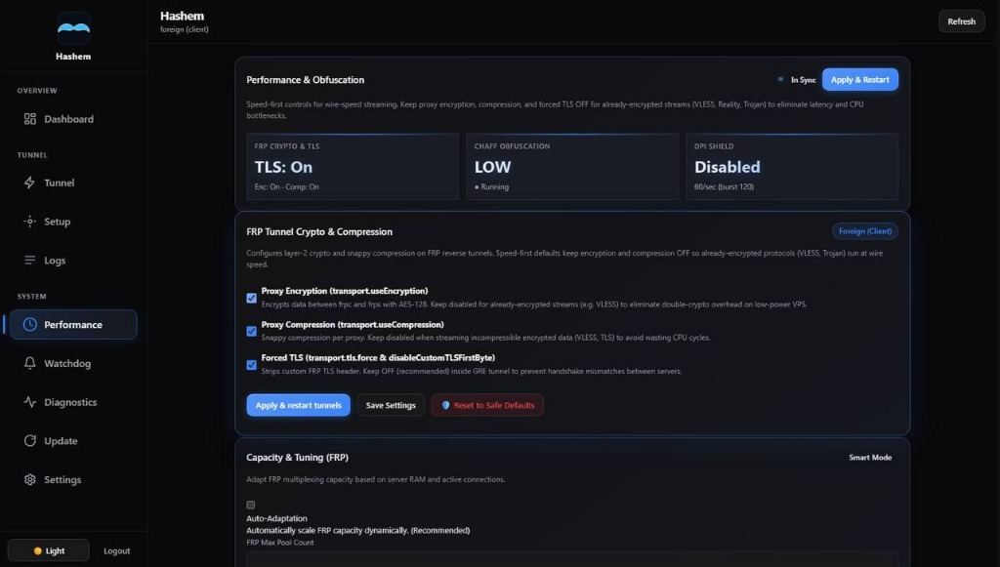
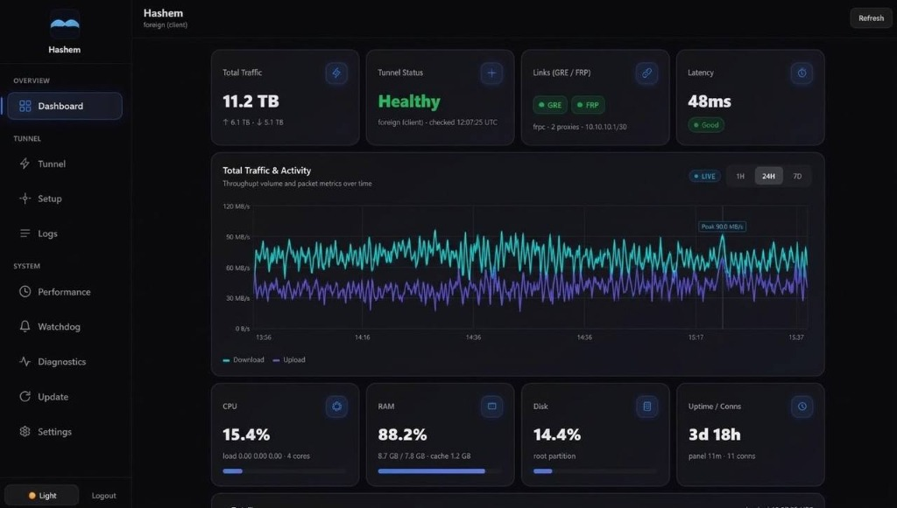
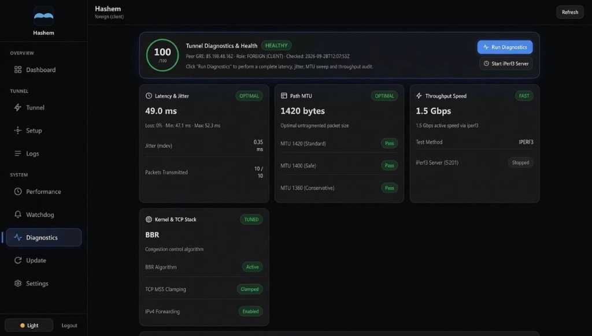
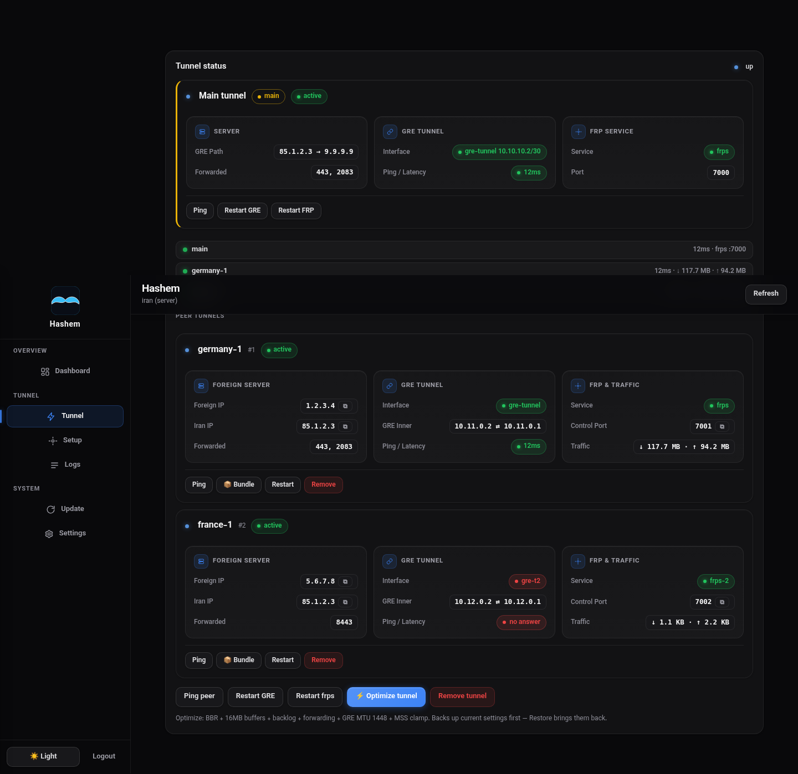

<div align="center">

# DNC MADE THIS

# Hashem Panel 🇮🇷 ↔ 🌍

**A Premium GRE Layer-3 Tunnel, Encrypted TLS FRP & High-Performance Backhaul Reverse Relay with a High-Tech Web Dashboard.**

[](https://github.com/pdnczone/hashem-panel/releases/latest)
[](https://github.com/pdnczone/hashem-panel/actions/workflows/build-panel.yml)
[](https://github.com/pdnczone/hashem-panel/actions/workflows/security.yml)
[](https://github.com/pdnczone/hashem-panel)
[](https://www.gnu.org/licenses/agpl-3.0)

[🌐 Website](https://pdnczone.ir) · [✈️ Telegram](https://t.me/pdnczone) · [▶️ YouTube](https://youtube.com/@pdnczone)

*Keep Iran's IP behind the tunnel — seamlessly expose foreign-server ports through Iran's public IP.*

> **خلاصه فارسی:** قدرتمندترین و زیباترین پنل مدیریت تونل‌های لایه ۳ (GRE) به همراه ریورس پروکسی رمزنگاری‌شده (FRP و Backhaul). نصب با یک خط کد. گزینه `1` برای سرور ایران و گزینه `2` برای سرور خارج. مجهز به امکانات امنیتی فوق‌پیشرفته (مطابق استانداردهای NIST 800-63B و OWASP، محافظت ضد جعل IP و لاگ‌های امنیتی)، پشتیبانی از نگاشت و رنج پورت‌ها، ریست پسورد تحت ترمینال و منو، و وب پنل فوق‌العاده مدرن.

</div>

---

## ✨ Features

- 🚀 **One-Line Installation:** Prebuilt standalone Go binary from official GitHub releases. Zero runtime dependencies.
- 🔄 **Dual Relay Engines:** Choose between **FRP** (Fast Reverse Proxy) and **Backhaul** (TCP, WS, WSS, TCPO with Mux & Snappy compression).
- 🖥️ **Premium Web Dashboard:** Ultra-modern, responsive, glassmorphic UI with dynamic traffic charts and dark mode.
- ⌨️ **`hashem` CLI Tool:** Complete control right from your SSH terminal using an interactive menu or direct CLI commands.
- 🌐 **Multi-Peer Architecture:** Connect up to 5 foreign servers to a single Iranian server simultaneously.
- 📦 **Automated Bundling:** Effortless pairing. One setup string (`hsh1_...`) carries all keys, IPs, transport types, and ports.
- 🔀 **Advanced Port Management:** Supports individual ports (`443`), multiple ports (`80,443`), port ranges (`1000-1010`), and port mappings (`8080=80`).
- 📊 **Deep Network Insights:** Real-time graphs, RAM/CPU vitals, Live Activity Streams, and exact traffic metrics.
- ⚡ **Auto-Adaptation:** Smartly adjusts multiplexing capacity dynamically based on active load and available system RAM.
- 🚀 **Advanced FRP Stack & Transports:** Full support for TCP, KCP (anti-packet-loss), QUIC (0-RTT), WebSocket, WSS, payload encryption, Snappy compression, and PROXY Protocol v2. **[📖 Full FRP Transports & Anti-Censorship Guide](docs/FRP_TUNNELS_GUIDE.md)**
- 🎯 **Carrier Benchmark:** Live probing across GRE Direct (Proto 47) and Obfuscated WSS (TLS 8443) with intelligent carrier health scoring.
- 🔗 **Inter-Panel Synchronization:** Dual-path REST link (Internal Tunnel IP + Public fallback) pairs Iran (Master) and Foreign (Worker) panels with shared secrets for coordinated zero-downtime reconfiguration.
- 🔑 **Instant Password Management:** Safe one-time display upon installation, interactive reset menu, and non-interactive `hashem reset-password` command.
- 🔒 **Enterprise-Grade Security:**
  - **No Plaintext Passwords:** Credentials stored exclusively as SHA-256 hashes (CWE-256 mitigation).
  - **NIST 800-63B Password Policy:** Enforces strong 12+ character passwords with uppercase, lowercase, numbers, and symbols.
  - **CSRF Defense:** Session-bound HMAC-SHA256 CSRF protection for all state-changing endpoints.
  - **IP Spoofing Protection:** Reverse proxy validation (`TRUSTED_PROXY_IPS`) prevents header-based brute-force bypasses.
  - **Integrity Verified Updates:** Pinned to official GitHub releases with SHA-256 checksum validation.
  - **Audit Logging:** Tamper-evident logging of all logins, password changes, updates, and shell commands.
- 💻 **In-Browser Terminal:** Interactive root shell (xterm.js + WebSocket + PTY) gated by admin permissions and session auditing.
- 🛡️ **DPI Shield & Traffic Chaff:** Built-in obfuscation and rate-limiting to defeat deep packet inspection and network scanning.

---

## 🏗️ How It Works (Architecture)

Hashem Panel operates on a two-node system using a reliable, low-overhead **GRE Layer-3** tunnel paired with your choice of reverse relay engine (**FRP** or **Backhaul**):

```text
Users ──► IRAN SERVER (Public Ports) ══════ GRE + [FRP / Backhaul] ══════► FOREIGN SERVER (Hidden)
              Relay listens :7000...                                       Client dials via 10.10.10.2
              GRE 10.10.10.2/30                                            GRE 10.10.10.1/30
```

1. **GRE Tunnel**: Establishes a direct Layer-3 point-to-point link between Iran and foreign servers.
2. **Relay Tunnel (FRP / Backhaul)**: Runs inside the GRE tunnel, multiplexing and encrypting connections.
   - **FRP Mode**: Battle-tested reverse proxy with token authentication.
   - **Backhaul Mode**: High-throughput multiplexed tunnel supporting TCP, WebSocket, WSS, and TCPO carrier modes with Snappy compression.
3. **Port Forwarding**: Public traffic arrives at the Iranian server and is seamlessly tunneled to the hidden foreign server.
4. **Web Panel**: Manages configuration, peers, TLS certificates, watchdog monitoring, and diagnostics locally on each server.

---

## ⚡ Quick Installation Guide

Install the entire system on **both** your Iran and Foreign servers using this simple one-liner command:

```bash
bash <(curl -fsSL https://raw.githubusercontent.com/pdnczone/hashem-panel/main/install.sh)
```

### 🛠️ Step-by-Step Setup

1. **Step 1 (On IRAN Server):**
   - Run the command above and choose option `1` from the menu.
   - Choose your transport mode (**FRP** or **Backhaul**), carrier type, and ports.
   - The installer will generate a **Setup Bundle** (e.g., `hsh1_85.1.2.3_7000_10.10.10.2_...`). **Copy this string.**
2. **Step 2 (On FOREIGN Server):**
   - Run the command above and choose option `2`.
   - Paste the copied bundle. The system automatically configures the tunnel and services.
3. **Step 3 (Access Web Panel):**
   - At the end of installation, you will receive your secure panel URL (`http://<server-ip>:7777/<secret>`) and initial administrator credentials displayed clearly in your terminal.
   - *Note: Passwords are not saved as plaintext on disk (CWE-256). Please save your password upon install. You can reset it anytime via `hashem reset-password` or CLI menu option `3 -> 2`.*

---

## 📋 `hashem` CLI Reference

Even without the web panel, the `hashem` command provides root-level control via SSH:

```bash
hashem                # Opens the full interactive tunnel menu
hashem status         # Shows tunnel health, peers, and service status
hashem reset-password # Interactively resets or auto-generates a new 16-char admin password
hashem password <p>   # Sets a new panel password non-interactively
hashem logs           # Tails live relay logs (FRP or Backhaul)
hashem optimize       # Automates BBR tuning, MTU adjustments, and sysctl buffers
hashem doctor         # Full network diagnostics (latency, jitter, MTU, speed)
hashem carrier        # Multi-carrier management (direct, fou, wss)
hashem backup now     # Creates an encrypted backup archive (/var/backups/hashem)
hashem chaff on       # Enables traffic obfuscation (idle-gap filler)
hashem dpi-shield     # Enables DPI Shield (rate-limits reverse ports)
hashem free-ram       # Frees system RAM and drops filesystem cache
hashem update         # Updates the script and web panel to the latest verified release
hashem uninstall      # Full wipe: cleanly removes services, configs, and binaries
```

---

## 🔐 Security & Hardening

Hashem Panel has undergone a full security hardening audit conforming to **OWASP Top 10** and **NIST 800-63B** guidelines:

- **Security Policy & Disclosures**: See [SECURITY.md](SECURITY.md).
- **Production Deployment Guide**: See [docs/DEPLOYMENT.md](docs/DEPLOYMENT.md) for reverse proxy (Nginx / Caddy), TLS certificates, firewall rules, and `TRUSTED_PROXY_IPS` configuration.
- **Audit Trails**: Security events, login attempts, password changes, and terminal commands are logged to `/etc/gre-panel/security-audit.log`.

---

## 📸 Panel Previews

<details open>
<summary><b>Click to expand and view screenshots</b></summary>
<br>
<table>
  <tr>
    <td width="50%">
      <b>Dashboard & Analytics (11TB+ Traffic)</b><br>
      
    </td>
    <td width="50%">
      <b>Advanced Tuning (Capacity & DPI Shield)</b><br>
      
    </td>
  </tr>
  <tr>
    <td width="50%">
      <b>Real-Time Diagnostics & Latency</b><br>
      
    </td>
    <td width="50%">
      <b>Multi-Peer Tunnel Management</b><br>
      
    </td>
  </tr>
</table>
</details>

---

## ⚖️ License

This project is licensed under the **GNU Affero General Public License v3.0 (AGPL-3.0)**.
If you modify this software and run it as a network service, you **must** make your modifications open-source and available under the same license. See the [LICENSE](LICENSE) file for more details.

---

## 🤝 Community & Support

Follow us on YouTube and Telegram for updates, tutorials, and support:

- 🌐 **Website (Services & Support):** [pdnczone.ir](https://pdnczone.ir)
- ✈️ **Telegram:** [@pdnczone](https://t.me/pdnczone)
- ▶️ **YouTube:** [@pdnczone](https://youtube.com/@pdnczone)

If you have feedback or feature requests, feel free to open an issue or submit a Pull Request!


