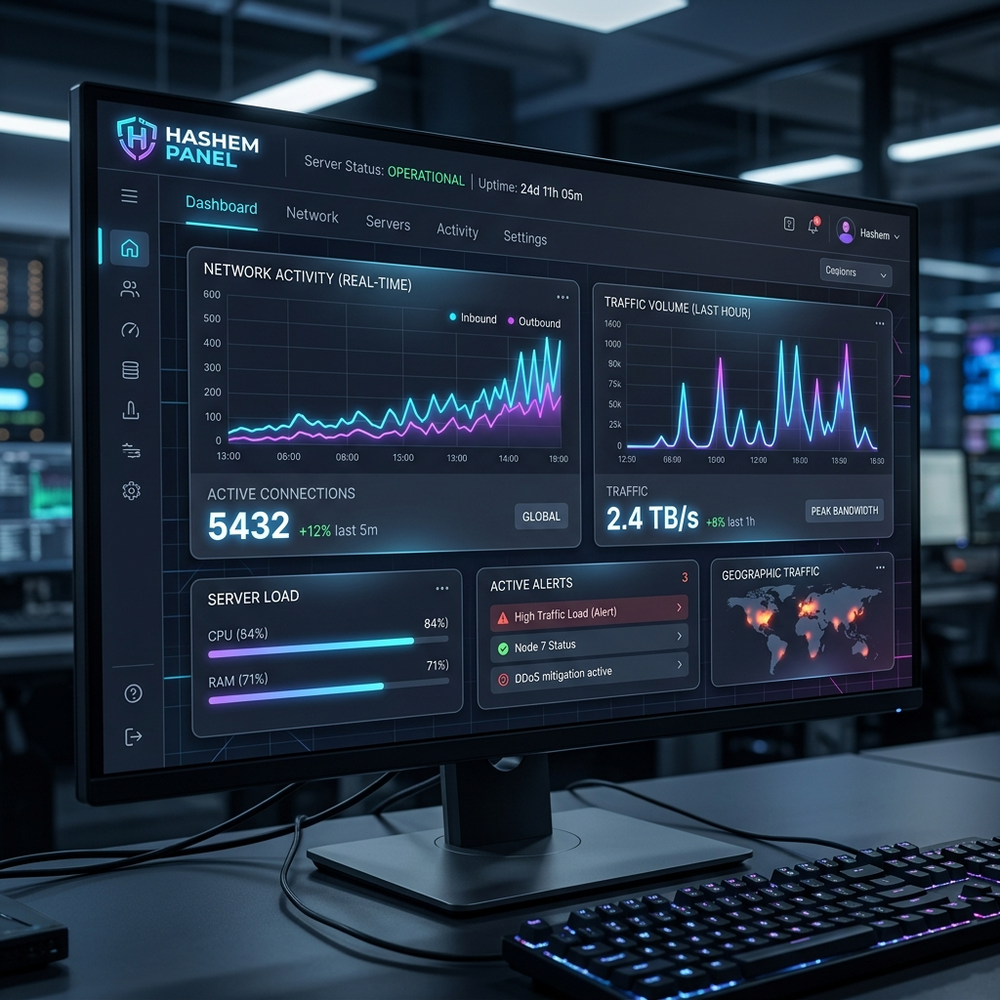
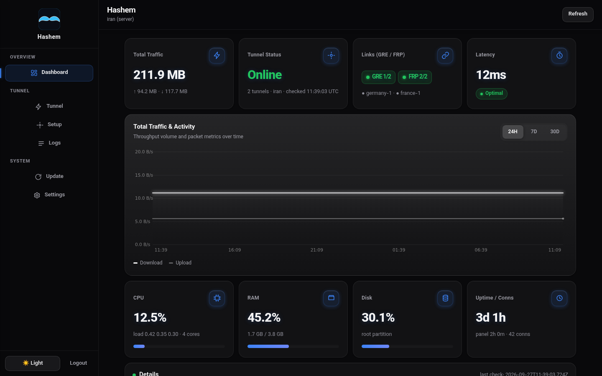
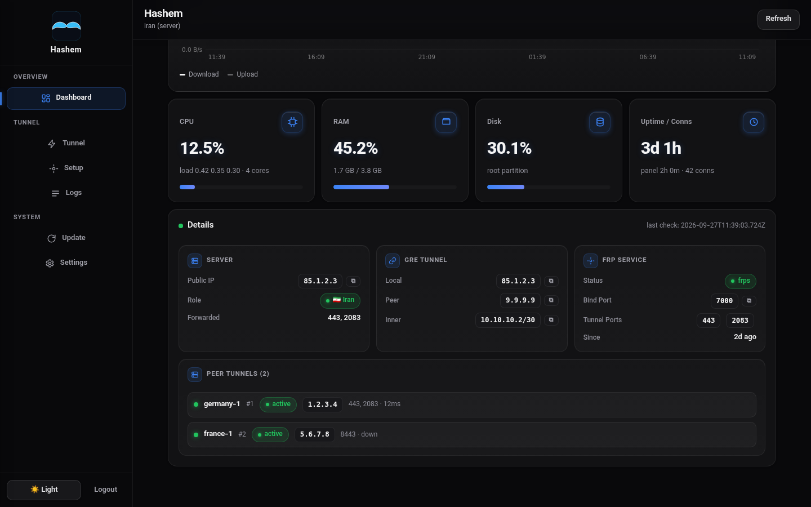

<div align="center">



# Hashem Panel 🇮🇷 ↔ 🌍

**A Premium GRE Layer-3 Tunnel & Encrypted TLS FRP Reverse Relay with a High-Tech Web Dashboard.**

[](https://github.com/pdnczone/hashem-panel/releases/latest)
[](https://github.com/pdnczone/hashem-panel/actions/workflows/build-panel.yml)
[](https://github.com/pdnczone/hashem-panel)
[](https://www.gnu.org/licenses/agpl-3.0)

[🌐 Website](https://pdnczone.ir) · [✈️ Telegram](https://t.me/pdnczone) · [▶️ YouTube](https://youtube.com/@pdnczone)

*Keep Iran's IP behind the tunnel — seamlessly expose foreign-server ports through Iran's public IP.*

> **خلاصه فارسی:** قدرتمندترین و زیباترین پنل مدیریت تونل‌های لایه ۳ (GRE) به همراه ریورس پروکسی رمزنگاری‌شده (FRP). نصب با یک خط کد. گزینه `1` برای سرور ایران و گزینه `2` برای سرور خارج. پس از نصب، پنل تحت وب با ظاهری بی‌نظیر برای مدیریت کامل سرورها در دسترس شماست.

</div>

---

## ✨ Features

- 🚀 **One-Line Installation:** Prebuilt standalone Go binary from GitHub releases. No dependencies required.
- 🖥️ **Premium Web Dashboard:** Ultra-modern, responsive, glassmorphic UI with dynamic charts and dark mode.
- ⌨️ **`hashem` CLI Tool:** Complete control right from your SSH terminal using an interactive menu.
- 🌐 **Multi-Peer Architecture:** Connect up to 5 foreign servers to a single Iranian server simultaneously.
- 📦 **Automated Bundling:** Effortless pairing. One setup string (`hsh1_...`) carries all keys, IPs, and ports.
- 📊 **Deep Network Insights:** Real-time graphs, RAM/CPU vitals, Live Activity Streams, and exact traffic metrics.
- ⚡ **Auto-Adaptation:** Smartly adjusts FRP multiplexing capacity dynamically based on active load and available RAM.
- 🔒 **Ironclad Security:** Integrated Let's Encrypt HTTPS, customizable secret URL paths, and audit-logged actions.
- 💻 **In-Browser Terminal:** Get an interactive root shell (xterm.js + WebSocket + PTY) right from the dashboard.
- 🛡️ **DPI Shield & Traffic Chaff:** Built-in obfuscation to defeat deep packet inspection and network scanning.

---

## 🏗️ How It Works (Architecture)

Hashem Panel operates on a two-node system using a reliable, low-overhead **GRE Layer-3** tunnel paired with a highly concurrent **FRP (Fast Reverse Proxy)** tunnel.

```text
Users ──► IRAN SERVER (Public Ports) ════ GRE + FRP ════► FOREIGN SERVER (Hidden)
              frps listens :7000...                         frpc dials via 10.10.10.2
              GRE 10.10.10.2/30                             GRE 10.10.10.1/30
```

1. **The GRE Tunnel** creates a direct Layer-3 link between the two servers.
2. **The FRP Tunnel** runs *inside* the GRE tunnel, encrypting the application data and bypassing censorship restrictions efficiently.
3. Every port is mapped via TCP/UDP proxies, meaning the end-user only interacts with the Iranian IP, keeping the Foreign IP entirely hidden.
4. **The Web Panel** communicates locally. The Iranian panel manages Iranian services, and the Foreign panel manages the Foreign services.

---

## ⚡ Quick Installation Guide

Install the entire system on **both** your Iran and Foreign servers using this simple one-liner command:

```bash
bash <(curl -fsSL https://raw.githubusercontent.com/pdnczone/hashem-panel/main/install.sh)
```

### 🛠️ Step-by-Step Setup

1. **Step 1 (On IRAN Server):** 
   - Run the command above and choose option `1` from the menu. 
   - Enter your Iran IP, Foreign IP, and FRP port (e.g., `7000`). 
   - The installer will generate a **Setup Bundle** (e.g., `hsh1_85.1.2.3_7000_10.10.10.2_...`). **Copy this string.**
2. **Step 2 (On FOREIGN Server):** 
   - Run the command above and choose option `2`. 
   - Paste the copied bundle. The system will automatically configure everything.
3. **Step 3 (Access Panel):** 
   - At the end of the installation, you will receive a secure URL (`http://<server-ip>:7777/<secret>`) along with your username and password.

---

## 📸 Panel Previews

<details>
<summary><b>Click to expand and view screenshots</b></summary>
<br>
<table>
  <tr>
    <td width="50%">
      <b>Dashboard & Analytics</b><br>
      
    </td>
    <td width="50%">
      <b>Multi-Peer Tunnel Management</b><br>
      
    </td>
  </tr>
  <tr>
    <td width="50%">
      <b>Dashboard Details</b><br>
      
    </td>
    <td width="50%">
      <b>Advanced Tuning (Capacity & DPI Shield)</b><br>
      <i>Features smart Auto-Tune capability based on server vitals.</i>
    </td>
  </tr>
</table>
</details>

---

## 📋 `hashem` CLI Reference

Even without the web panel, the `hashem` command provides deep root-level control via SSH:

```bash
hashem            # Opens the full interactive tunnel menu
hashem status     # Shows tunnel health and status
hashem logs       # Tails the live FRP logs
hashem optimize   # Automates BBR tuning, MTU adjustments, and sysctl buffers
hashem update     # Updates the script and web panel to the latest version
```

---

## ⚖️ License

This project is licensed under the **GNU Affero General Public License v3.0 (AGPL-3.0)**.
This is a strict copyleft license. If you modify this software and run it as a network service, you **must** make your modifications open-source and available to your users under the same license. See the [LICENSE](LICENSE) file for more details.

---

## 🤝 Community & Support

**Created & Maintained by PDNC**

- 🌐 **Website:** [pdnczone.ir](https://pdnczone.ir)
- ✈️ **Telegram:** [@pdnczone](https://t.me/pdnczone)
- ▶️ **YouTube:** [@pdnczone](https://youtube.com/@pdnczone)

If you have feedback or feature requests, feel free to open an issue or submit a Pull Request!
